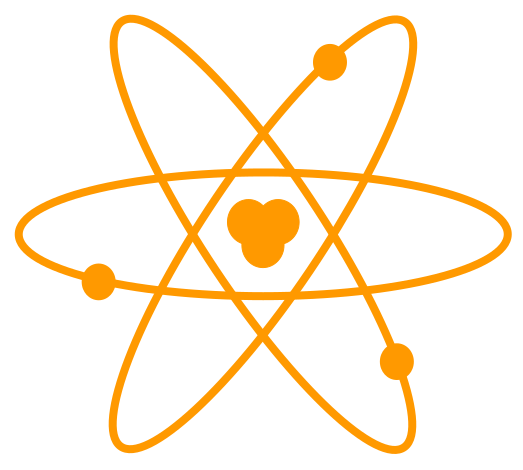
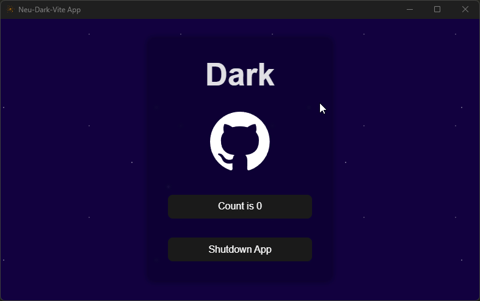

# neu-dark-vite

An experimental template for building Neutralino.js apps using Dark and Vite.



## Installation

Choose one of the following two options:

### Neutralino App Template

```
npx @neutralinojs/neu create app --template benjammin4dayz/neu-dark-vite
cd app
```

**-- or --**

### Browser Template

```
npx degit github:benjammin4dayz/neu-dark-vite/dark-src app
cd app
npm i
```

## Usage

```bash
# Develop
npm start
# Build
npm run build
# Package (Neutralino Template only)
npm run build:release
```

- Frontend development server is located on port `3000`

- If you remove dependencies after the initial `neu create` step, reinstall them using `npm run setup`
